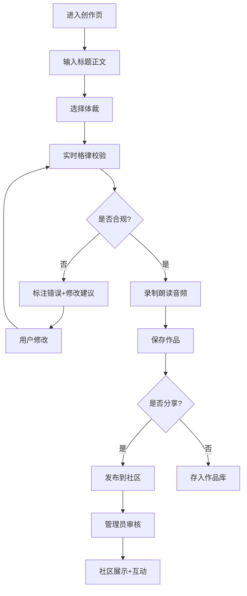

## 1. 产品概述

个人诗歌创作与鉴赏APP，围绕用户诗意生活场景设计，提供诗歌创作、格律校验、朗读录制、社区互动和创作报告一体化服务。帮助用户提升诗词创作水平，记录创作历程，构建诗意交流社区。

- 核心价值：让传统诗歌创作现代化、智能化，降低格律门槛，激发创作热情
- 目标用户：诗词爱好者、文学创作者、学生群体

## 2. 核心功能

### 2.1 用户角色

| 角色 | 注册方式 | 核心权限 |
|------|----------|----------|
| 普通用户 | 手机号/邮箱注册 | 创作作品、录制音频、社区互动、查看报告 |
| 管理员 | 后台账号登录 | 审核内容、管理分类、查看数据统计 |

### 2.2 功能模块

1. **首页**：每日推荐、热门诗作、创作入口、提醒设置
2. **创作页**：标题正文输入、体裁选择、格律实时校验、修改建议、音频录制
3. **作品库**：个人作品列表、体裁筛选、搜索、详情查看
4. **社区页**：作品分享、点赞评论收藏、热门排行、分类浏览
5. **报告页**：月度创作报告、数据统计、PDF导出
6. **管理后台**：内容审核、分类管理、用户管理

### 2.3 页面详情

| 页面名称 | 模块名称 | 功能描述 |
|----------|----------|----------|
| 首页 | 每日推荐 | 展示精选诗作和创作灵感提示 |
| 首页 | 热门排行 | 按互动热度展示社区热门作品 |
| 首页 | 创作提醒 | 每日定时推送创作提醒，支持自定义时间 |
| 创作页 | 格律校验 | 实时检测平仄、押韵，标注错误并给出修改建议 |
| 创作页 | 音频录制 | 支持录制朗读音频，生成波形图，限制MP3格式10MB以内 |
| 创作页 | 表单校验 | 标题正文非空、体裁必选、错误明确提示 |
| 作品库 | 作品管理 | 查看、编辑、删除个人作品，按体裁筛选 |
| 社区页 | 互动功能 | 点赞、评论、收藏、分享作品 |
| 报告页 | 月度报告 | 作品篇数、体裁分布、人气排行、朗读总时长统计 |
| 管理后台 | 内容审核 | 审核社区发布内容，处理违规内容 |
| 管理后台 | 分类管理 | 管理诗歌体裁分类 |

## 3. 核心流程

### 3.1 创作流程
用户进入创作页 → 输入标题和正文 → 选择诗歌体裁 → 系统实时校验格律 → 标注不合规处并给出修改建议 → 用户修改后可录制朗读音频 → 保存作品 → 可选择分享到社区

### 3.2 社区互动流程
用户浏览社区作品 → 点赞/收藏/评论 → 系统按热度推荐热门作品 → 管理员审核内容

### 3.3 报告生成流程
每月自动生成创作报告 → 展示作品统计、体裁分布、人气排行、朗读时长 → 用户可导出PDF

## 4. 用户界面设计

### 4.1 设计风格
- **设计理念**：东方水墨诗意美学，简约典雅，富有文化底蕴
- **主色调**：墨色渐变（深灰#1a1a2e到中灰#16213e）、朱砂红（#e94560）作为点缀色
- **辅助色**：宣纸米白（#f5f0e1）、竹青（#4a7c59）
- **字体**：标题使用「思源宋体」展示东方韵味，正文使用「思源黑体」保证可读性
- **视觉元素**：水墨晕染背景、毛笔笔触装饰、山水留白布局
- **按钮风格**：圆角矩形，简约水墨边框，悬停时朱砂红渐变效果
- **动效**：水墨晕染过渡、文字淡入效果、波纹扩散动画

### 4.2 页面设计概述

| 页面名称 | 模块名称 | UI元素 |
|----------|----------|--------|
| 首页 | Hero区域 | 水墨山水背景、毛笔书法标题、渐显动画 |
| 首页 | 每日推荐 | 卡片式布局、作品预览、作者信息、互动数据 |
| 首页 | 创作入口 | 悬浮圆形按钮、朱砂红渐变、点击波纹效果 |
| 创作页 | 编辑区域 | 宣纸质感背景、竖排/横排切换、行号显示 |
| 创作页 | 格律校验 | 平仄标注（平声绿色、仄声红色）、押韵高亮、错误下划线、悬浮提示修改建议 |
| 创作页 | 音频录制 | 波形图实时显示、录制按钮动画、进度条、时长显示 |
| 社区页 | 作品列表 | 瀑布流布局、作品卡片、互动按钮、分类标签 |
| 报告页 | 数据可视化 | 柱状图（体裁分布）、折线图（创作趋势）、饼图（互动占比）、水墨风格图表 |
| 管理后台 | 审核面板 | 表格布局、审核按钮、状态标签、批量操作 |

### 4.3 响应式设计
- **桌面端**（≥1280px）：三栏布局，左侧导航、中间内容区、右侧信息面板
- **平板端**（768px-1279px）：两栏布局，可折叠侧边栏，主内容区自适应
- **移动端**（<768px）：单栏布局，底部Tab导航，触摸优化交互
- **核心适配**：创作编辑器在移动端支持横屏创作，音频波形图自适应宽度

### 4.4 交互细节
- **创作页**：输入时实时格律校验，每字标注平仄，错误处轻微抖动提示
- **音频录制**：按钮按下开始录制（录音动画），松开停止，波形随音量动态变化
- **社区互动**：点赞按钮爱心填充动画，评论区滑入效果
- **报告导出**：导出时显示加载动画，PDF预览后下载
