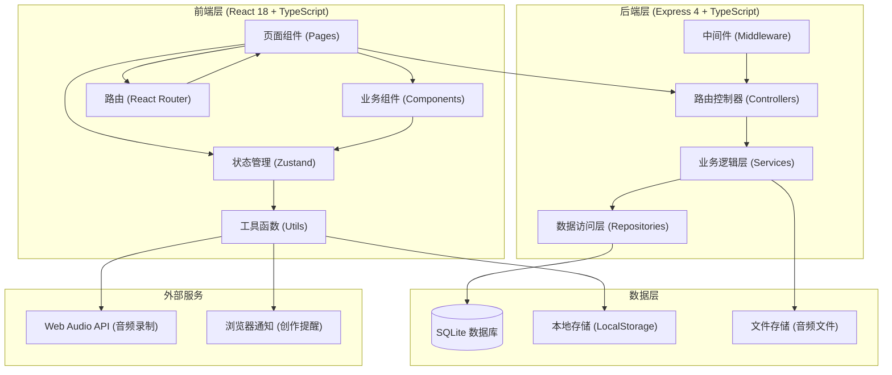
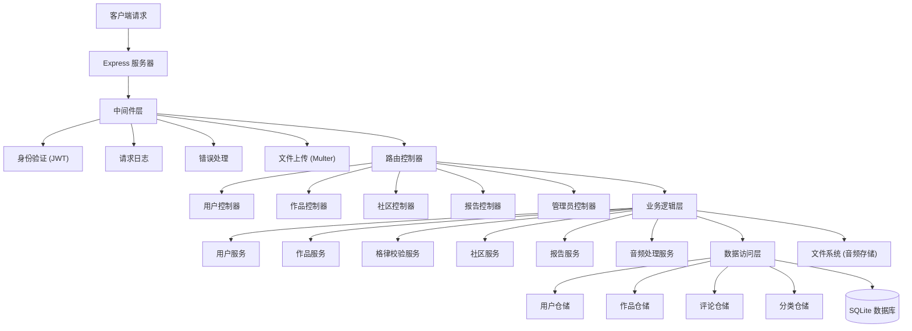
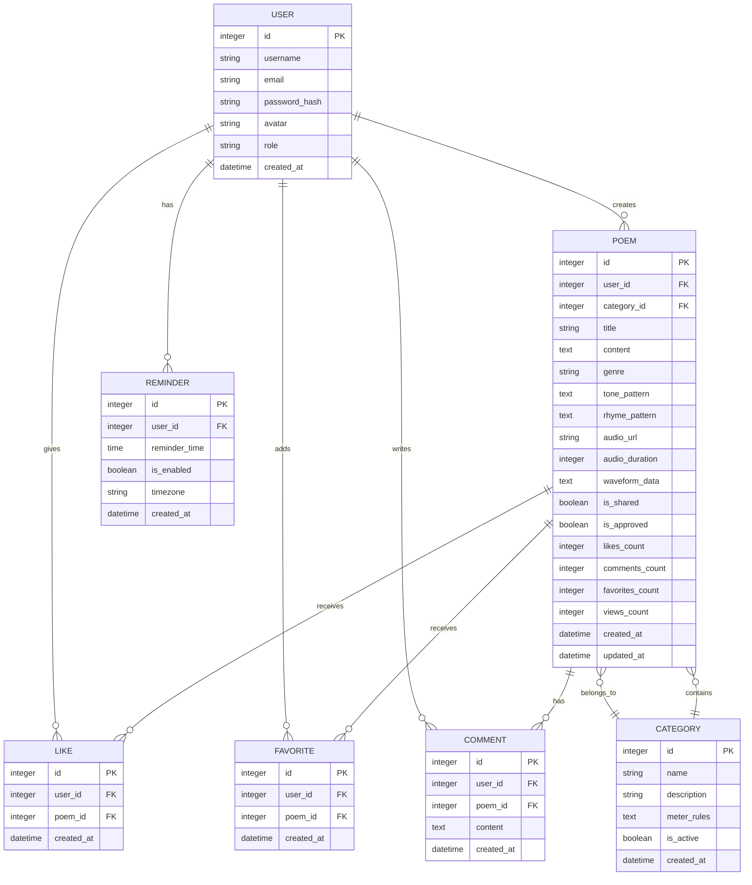

## 1. 架构设计



## 2. 技术描述

- **前端框架**: React@18.2.0 + TypeScript@5.3.0
- **构建工具**: Vite@5.0.0
- **样式方案**: Tailwind CSS@3.4.0
- **状态管理**: Zustand@4.4.0
- **路由管理**: React Router DOM@6.20.0
- **图表库**: Recharts@2.10.0
- **PDF导出**: jspdf@2.5.1 + html2canvas@1.4.1
- **图标库**: lucide-react@0.294.0
- **后端框架**: Express@4.18.2 + TypeScript@5.3.0
- **数据库**: SQLite3 + better-sqlite3@9.2.0
- **ORM**: Drizzle ORM@0.29.0
- **文件上传**: multer@1.4.4
- **音频处理**: Web Audio API (浏览器原生)
- **包管理器**: npm

## 3. 路由定义

| 路由 | 页面 | 用途 |
|------|------|------|
| `/` | Home | 首页，每日推荐、热门诗作 |
| `/create` | Create | 创作页，诗歌创作与格律校验 |
| `/works` | Works | 作品库，个人作品列表 |
| `/works/:id` | WorkDetail | 作品详情页 |
| `/community` | Community | 社区页，作品分享与互动 |
| `/report` | Report | 月度创作报告 |
| `/admin` | Admin | 管理后台 |
| `/admin/review` | Review | 内容审核 |
| `/admin/categories` | Categories | 分类管理 |
| `/login` | Login | 用户登录 |
| `/register` | Register | 用户注册 |

## 4. API 定义

```typescript
// 通用响应类型
interface ApiResponse<T> {
  success: boolean;
  data?: T;
  message?: string;
  errors?: string[];
}

// 用户相关
interface User {
  id: number;
  username: string;
  email: string;
  avatar?: string;
  role: 'user' | 'admin';
  createdAt: string;
}

// 作品相关
interface Poem {
  id: number;
  userId: number;
  title: string;
  content: string;
  genre: string;
  tonePattern?: string;
  rhymePattern?: string;
  audioUrl?: string;
  audioDuration?: number;
  waveformData?: number[];
  isShared: boolean;
  isApproved: boolean;
  likes: number;
  comments: number;
  favorites: number;
  views: number;
  createdAt: string;
  updatedAt: string;
  author?: User;
}

// 格律校验结果
interface MeterCheckResult {
  isValid: boolean;
  charResults: {
    char: string;
    position: number;
    expectedTone: '平' | '仄' | '中';
    actualTone: '平' | '仄' | '未知';
    isCorrect: boolean;
    suggestion?: string;
  }[];
  rhymeResults: {
    lineIndex: number;
    char: string;
    expectedRhyme: string;
    actualRhyme: string;
    isCorrect: boolean;
    suggestion?: string;
  }[];
  suggestions: string[];
}

// API 端点
GET    /api/users/profile                获取用户信息
PUT    /api/users/profile                更新用户信息
GET    /api/users/reminder               获取提醒设置
PUT    /api/users/reminder               更新提醒设置

GET    /api/poems                        获取作品列表
GET    /api/poems/:id                    获取作品详情
POST   /api/poems                        创建作品
PUT    /api/poems/:id                    更新作品
DELETE /api/poems/:id                    删除作品
POST   /api/poems/:id/share              分享作品到社区
POST   /api/poems/:id/audio              上传音频
POST   /api/poems/check                  格律校验

GET    /api/community                    获取社区作品
GET    /api/community/:id                获取社区作品详情
POST   /api/community/:id/like           点赞
POST   /api/community/:id/favorite       收藏
GET    /api/community/:id/comments       获取评论
POST   /api/community/:id/comments       发表评论

GET    /api/report/monthly               获取月度报告
GET    /api/report/monthly/export        导出PDF报告

GET    /api/admin/poems/pending          获取待审核作品
PUT    /api/admin/poems/:id/approve      审核通过
PUT    /api/admin/poems/:id/reject       审核拒绝
GET    /api/admin/categories             获取分类列表
POST   /api/admin/categories             创建分类
PUT    /api/admin/categories/:id         更新分类
DELETE /api/admin/categories/:id         删除分类

POST   /api/auth/login                   登录
POST   /api/auth/register                注册
POST   /api/auth/logout                  登出
```

## 5. 服务器架构图



## 6. 数据模型

### 6.1 ER 图



### 6.2 DDL 语句

```sql
-- 用户表
CREATE TABLE IF NOT EXISTS users (
    id INTEGER PRIMARY KEY AUTOINCREMENT,
    username VARCHAR(50) UNIQUE NOT NULL,
    email VARCHAR(100) UNIQUE NOT NULL,
    password_hash VARCHAR(255) NOT NULL,
    avatar VARCHAR(255),
    role VARCHAR(20) DEFAULT 'user' CHECK (role IN ('user', 'admin')),
    created_at DATETIME DEFAULT CURRENT_TIMESTAMP
);

-- 分类表
CREATE TABLE IF NOT EXISTS categories (
    id INTEGER PRIMARY KEY AUTOINCREMENT,
    name VARCHAR(50) UNIQUE NOT NULL,
    description TEXT,
    meter_rules TEXT,
    is_active BOOLEAN DEFAULT 1,
    created_at DATETIME DEFAULT CURRENT_TIMESTAMP
);

-- 作品表
CREATE TABLE IF NOT EXISTS poems (
    id INTEGER PRIMARY KEY AUTOINCREMENT,
    user_id INTEGER NOT NULL,
    category_id INTEGER,
    title VARCHAR(255) NOT NULL,
    content TEXT NOT NULL,
    genre VARCHAR(50) NOT NULL,
    tone_pattern TEXT,
    rhyme_pattern TEXT,
    audio_url VARCHAR(255),
    audio_duration INTEGER,
    waveform_data TEXT,
    is_shared BOOLEAN DEFAULT 0,
    is_approved BOOLEAN DEFAULT 0,
    likes_count INTEGER DEFAULT 0,
    comments_count INTEGER DEFAULT 0,
    favorites_count INTEGER DEFAULT 0,
    views_count INTEGER DEFAULT 0,
    created_at DATETIME DEFAULT CURRENT_TIMESTAMP,
    updated_at DATETIME DEFAULT CURRENT_TIMESTAMP,
    FOREIGN KEY (user_id) REFERENCES users(id) ON DELETE CASCADE,
    FOREIGN KEY (category_id) REFERENCES categories(id) ON DELETE SET NULL
);

-- 点赞表
CREATE TABLE IF NOT EXISTS likes (
    id INTEGER PRIMARY KEY AUTOINCREMENT,
    user_id INTEGER NOT NULL,
    poem_id INTEGER NOT NULL,
    created_at DATETIME DEFAULT CURRENT_TIMESTAMP,
    FOREIGN KEY (user_id) REFERENCES users(id) ON DELETE CASCADE,
    FOREIGN KEY (poem_id) REFERENCES poems(id) ON DELETE CASCADE,
    UNIQUE(user_id, poem_id)
);

-- 收藏表
CREATE TABLE IF NOT EXISTS favorites (
    id INTEGER PRIMARY KEY AUTOINCREMENT,
    user_id INTEGER NOT NULL,
    poem_id INTEGER NOT NULL,
    created_at DATETIME DEFAULT CURRENT_TIMESTAMP,
    FOREIGN KEY (user_id) REFERENCES users(id) ON DELETE CASCADE,
    FOREIGN KEY (poem_id) REFERENCES poems(id) ON DELETE CASCADE,
    UNIQUE(user_id, poem_id)
);

-- 评论表
CREATE TABLE IF NOT EXISTS comments (
    id INTEGER PRIMARY KEY AUTOINCREMENT,
    user_id INTEGER NOT NULL,
    poem_id INTEGER NOT NULL,
    content TEXT NOT NULL,
    created_at DATETIME DEFAULT CURRENT_TIMESTAMP,
    FOREIGN KEY (user_id) REFERENCES users(id) ON DELETE CASCADE,
    FOREIGN KEY (poem_id) REFERENCES poems(id) ON DELETE CASCADE
);

-- 提醒设置表
CREATE TABLE IF NOT EXISTS reminders (
    id INTEGER PRIMARY KEY AUTOINCREMENT,
    user_id INTEGER NOT NULL,
    reminder_time TIME DEFAULT '09:00:00',
    is_enabled BOOLEAN DEFAULT 1,
    timezone VARCHAR(50) DEFAULT 'Asia/Shanghai',
    created_at DATETIME DEFAULT CURRENT_TIMESTAMP,
    FOREIGN KEY (user_id) REFERENCES users(id) ON DELETE CASCADE,
    UNIQUE(user_id)
);

-- 索引
CREATE INDEX IF NOT EXISTS idx_poems_user_id ON poems(user_id);
CREATE INDEX IF NOT EXISTS idx_poems_category_id ON poems(category_id);
CREATE INDEX IF NOT EXISTS idx_poems_is_shared ON poems(is_shared);
CREATE INDEX IF NOT EXISTS idx_poems_is_approved ON poems(is_approved);
CREATE INDEX IF NOT EXISTS idx_poems_created_at ON poems(created_at);
CREATE INDEX IF NOT EXISTS idx_likes_poem_id ON likes(poem_id);
CREATE INDEX IF NOT EXISTS idx_comments_poem_id ON comments(poem_id);
CREATE INDEX IF NOT EXISTS idx_favorites_poem_id ON favorites(poem_id);

-- 初始化分类数据
INSERT OR IGNORE INTO categories (name, description, meter_rules) VALUES
('五言绝句', '四句，每句五字，共20字', '{"lines": 4, "charsPerLine": 5, "pattern": ["仄仄平平仄", "平平仄仄平", "平平平仄仄", "仄仄仄平平"]}'),
('七言绝句', '四句，每句七字，共28字', '{"lines": 4, "charsPerLine": 7, "pattern": ["平平仄仄仄平平", "仄仄平平仄仄平", "仄仄平平平仄仄", "平平仄仄仄平平"]}'),
('五言律诗', '八句，每句五字，共40字', '{"lines": 8, "charsPerLine": 5, "pattern": ["仄仄平平仄", "平平仄仄平", "平平平仄仄", "仄仄仄平平", "仄仄平平仄", "平平仄仄平", "平平平仄仄", "仄仄仄平平"]}'),
('七言律诗', '八句，每句七字，共56字', '{"lines": 8, "charsPerLine": 7, "pattern": ["平平仄仄仄平平", "仄仄平平仄仄平", "仄仄平平平仄仄", "平平仄仄仄平平", "平平仄仄平平仄", "仄仄平平仄仄平", "仄仄平平平仄仄", "平平仄仄仄平平"]}'),
('词', '长短句，依词牌格律', '{"custom": true}'),
('曲', '元曲体裁', '{"custom": true}'),
('现代诗', '自由体，无严格格律', '{"custom": true}'),
('古风', '古体诗，格律较宽', '{"custom": true}');

-- 初始化管理员账号 (密码: admin123)
INSERT OR IGNORE INTO users (username, email, password_hash, role) VALUES
('admin', 'admin@poetry.com', '$2b$10$N9qo8uLOickgx2ZMRZoMyeIjZAgcfl7p92ldGxad68LJZdL17lhWy', 'admin');
```
